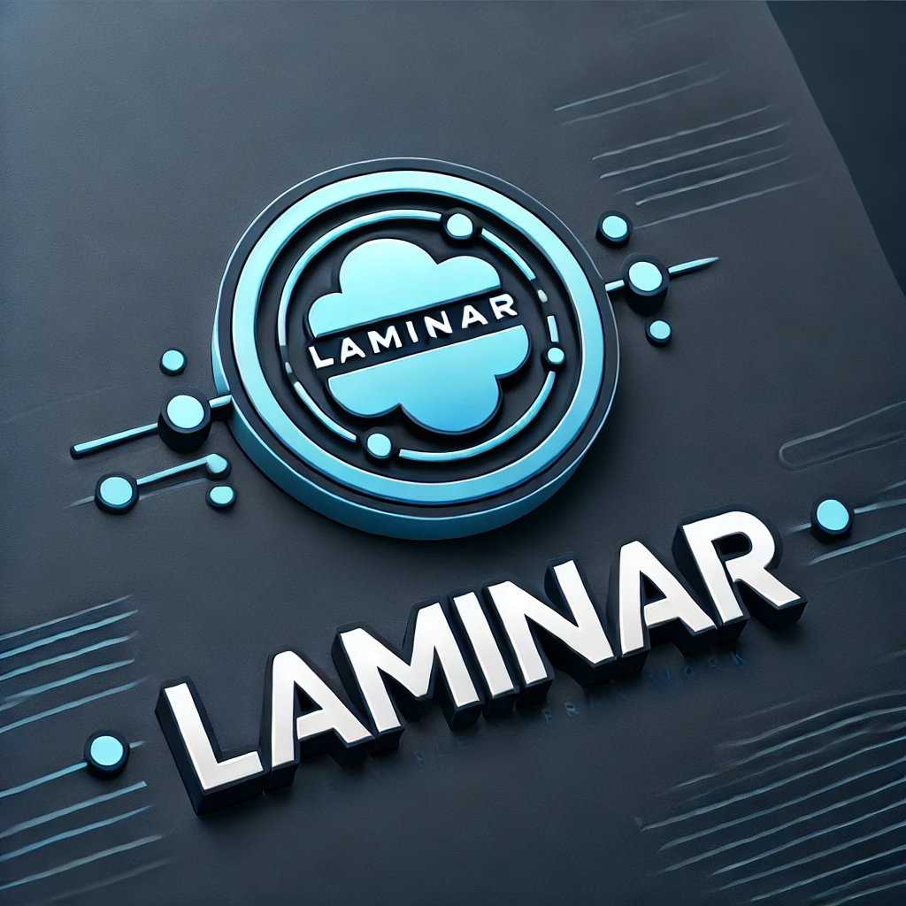

# Laminar 3.0 Client



## Overview

The Laminar Client is the primary user-facing component of the **Laminar** framework. It provides a unified
interface for registering, managing, searching, and executing [dispel4py](https://github.com/StreamingFlow/dispel4py)
stream-based workflows, either through an interactive **Command Line Interface (CLI)** or directly from **Python code
and Jupyter notebooks**.

The client communicates with the Laminar Server to authenticate users, register workflows and Processing Elements
(PEs), submit executions, and monitor their progress. Through this interaction, the Laminar Client enables efficient
and scalable execution of data-intensive applications using dispel4py's automatic parallelisation and dynamic
execution capabilities.

In addition to workflow management, the client now integrates **Large Language Models (LLMs)** to assist users
throughout the development lifecycle: automatically describing and tagging components at registration time, powering
semantic search and code recommendation, and even composing brand-new workflows from a natural-language request.

## What's New
 
If you have used an earlier version of the client, the most important changes are:
 
- **LLM-assisted registration.** When you register a PE or workflow, the client can call an LLM to automatically
  generate a description, document its inputs/outputs, and assign tags. Supported providers are **OpenAI**,
  **Google Gemini**, and **OpenWebUI**.
- **Semantic and AI-driven search.** Beyond literal keyword matching, the CLI offers semantic search, code
  recommendation, and an `advanced_search` command that proposes (and can register) a complete workflow when no good
  match exists in the registry.
- **Function-to-PE conversion.** A new `--convert` mode turns a plain Python function into a dispel4py PE
  (Producer / Iterative / Consumer) without writing the boilerplate by hand.

## Architecture at a Glance

The Laminar Client acts as the entry point into the Laminar ecosystem and integrates with the following components:

- **Laminar Server** — Handles authentication, request routing, registry storage, and workflow management.
- **Laminar Execution Engine** — Executes registered workflows (sequential, multiprocessing, or Redis-based dynamic
  execution).
- **dispel4py** — Defines stream-based workflows and Processing Elements (provided by the `stream_d4py` package).
- **LLM providers** — Optional integration with OpenAI, Gemini, or OpenWebUI for description generation, semantic
  search, and workflow composition.

Together, these components provide a flexible environment for developing and running scalable data processing
pipelines.

## Getting Started

Before running the Laminar Client, pleas eensure that you have a running dispel4py-server instance.

### Clone the Repository

```bash
git clone https://github.com/StreamingFlow/dispel4py-client.git
cd dispel4py-client
```

### Python Environment

A Python **3.11, 3.12, or 3.13** environment is required. The recommended approach is to use Conda.

```bash
conda create --name laminar python=3.11
conda activate laminar
```

### Install the Laminar Client

Install the client and the `laminar` CLI tool locally:

```bash
pip install .
```

After installation, configure the target Laminar Server by editing the `config.ini` file and setting the server URL:

```ini
[CONFIGURATION]
SERVER_URL = http://127.0.0.1:8080
```

If no URL is configured, the client falls back to `http://127.0.0.1:8080`.

### Configure LLM Access (Optional but Recommended)

Several features, like automatic description generation at registration, semantic search, code recommendation, and
workflow composition,  rely on an LLM provider. Configure at least one of the following via environment variables:

| Provider   | Required environment variables                          |
| ---------- | ------------------------------------------------------- |
| OpenAI     | `OPENAI_API_KEY`                                        |
| Gemini     | `GEMINI_API_KEY`                                        |
| OpenWebUI  | `OPENWEBUI_API_KEY`, `OPENWEBUI_BASE_URL`               |

```bash
export OPENAI_API_KEY="sk-..."
# and/or
export GEMINI_API_KEY="..."
# and/or
export OPENWEBUI_API_KEY="..."
export OPENWEBUI_BASE_URL="https://your-openwebui-host"
```

OpenAI is used as the default provider. If a provider's credentials are not set, the client simply skips it; if none
are available, LLM-dependent commands will not work.

## Using the Laminar Client in Python

The `CLIENT_EXAMPLES` directory contains example dispel4py workflows that already integrate Laminar client functions.
These demonstrate how to authenticate, register workflows, search the registry, and trigger executions
programmatically.

Available examples include:

- **IsPrime.py** — Generates random values and outputs only the prime numbers, then demonstrates literal/semantic
  search, code recommendation, and all three execution modes.
- **WordCount.py** — Counts the frequency of each word in a user-provided text.
- **SensorIoT.py** — Simulates an IoT sensor data processing workflow.
- **AstroPhysics.py** — Implements an astrophysics workflow.

An interactive Jupyter notebook example is also provided:

- **Laminar_Notebook_Sample.ipynb**

Additional workflow and PE files that do **not** include client functions are also available in `CLIENT_EXAMPLES` and
can be used directly with the CLI.

### A Minimal Python Example

```python
from dispel4py.workflow_graph import WorkflowGraph
from laminar.client.d4pyclient import d4pClient

# ... build your dispel4py graph (PEs + connections) ...
graph = WorkflowGraph()

client = d4pClient()

# Register / log in (registration is only needed once)
# client.register("username", "password")
client.login("username", "password")

# Register the workflow. If no description is provided, Laminar generates one
# automatically using the configured LLM provider.
client.register_Workflow(graph, "graph_sample")

# Search the registry
client.search_Registry_Literal("prime", "pe")          # keyword search
client.search_Registry_Semantic("checks prime numbers", "pe")  # semantic search
client.code_Recommendation("random.randint(1, 1000)", "pe")    # code -> matches

# Execute the workflow
client.run(graph, input=100)               # SIMPLE: sequential
client.run_multiprocess(graph, input=100)  # MULTI: multiprocessing
client.run_dynamic(graph, input=100)       # DYNAMIC: Redis-based
```

### Running Client-Based Examples

To execute a workflow that includes client functions:

```bash
cp CLIENT_EXAMPLES/<file> .
python <file>
```

Before running these examples, ensure that you have registered a user and logged in using the Laminar client
functions, as authentication is required to interact with the Laminar framework.

## Using the Laminar CLI

### Register a New User

Register a user account (required only once per user):

```bash
laminar --register
```

You will be prompted for a username and password. You can also supply the username on the command line and/or skip the
prompts using environment variables:

```bash
laminar --register -u <username>
```

- `LAMINAR_USERNAME` — A previously registered Laminar username.
- `LAMINAR_PASSWORD` — The password for that account.

### Convert a Python Function into a PE

The client can transform a generic Python function into a dispel4py PE. The function must take **at most one
parameter** and return **at most one value** (it is mapped to a Producer, Iterative, or Consumer PE accordingly):

```bash
laminar --convert -f path/to/my_function.py
```

The converted PE is printed and written to `path/to/my_function_pe.py`.

### Launch the CLI

Start the interactive CLI session:

```bash
laminar
```

Alternatively, if running from the source directory:

```bash
python -m laminar
```

On first launch you will be asked to log in (unless `LAMINAR_USERNAME` / `LAMINAR_PASSWORD` env vars are set).

### Preparing Workflows for the CLI

For CLI-based testing, copy workflow or PE files that do not include client functions from `CLIENT_EXAMPLES`:

```bash
cp CLIENT_EXAMPLES/<file> .
laminar
```

### CLI Commands

Within the interactive `(laminar) >` prompt, the following commands are available. Type `help <command>` for full
usage details.

| Command              | Description                                                                                          |
| -------------------- | ---------------------------------------------------------------------------------------------------- |
| `register`           | Register a `workflow` or `pe` from a file. Optionally `--provider` selects the LLM used to describe it. |
| `run`                | Run a workflow by name or ID, with input, resources, and execution mode options.                     |
| `search`             | Search the registry by `literal` keyword or `semantic` meaning, over `workflow`, `pe`, or `both`.    |
| `advanced_search`    | Semantic library search that proposes (and can register/save) a new workflow when no match is found. |
| `code_recommendation`| Recommend registered components matching a code snippet (`--embedding_type spt` or `llm`).           |
| `describe`           | Show details for a PE or workflow by name/ID (`--source_code` to include the source).                |
| `list`               | List all registered PEs and workflows.                                                               |
| `update_description` | Update the description of a `pe` or `workflow` by ID.                                                 |
| `remove`             | Remove a `workflow`, `pe`, or `all` registered objects by ID.                                        |
| `quit`               | Exit the CLI.                                                                                         |

### Registering Workflows and Processing Elements

```bash
(laminar) > register workflow wordcount_wf.py
(laminar) > register workflow sensor_wf.py
(laminar) > register pe isprimePE.py
```

By default, descriptions, input/output documentation, and tags are generated automatically with OpenAI. To use a
different provider:

```bash
(laminar) > register workflow wordcount_wf.py --provider gemini
```

### Running Workflows

```bash
# Run by name with input, sequentially
(laminar) > run my_workflow -i '[{"input": "1,2,3"}]'

# Run with Redis-based dynamic parallelism and verbose output
(laminar) > run my_workflow -i 100 --dynamic -v

# Run by ID with multiprocessing
(laminar) > run 123 --input '[{"input": "1,2,3"}]' --multi --verbose

# Run with attached resource files
(laminar) > run my_workflow --dynamic --resource file1.txt --resource file2.txt
```

Execution modes: the default is **SIMPLE** (sequential); `--multi` enables **MULTI** (multiprocessing); `--dynamic`
enables **DYNAMIC** (Redis).

### Searching the Registry

```bash
(laminar) > search literal pe prime
(laminar) > search semantic pe "checks prime numbers"
(laminar) > advanced_search build a workflow that counts words in a text
```

Additional dispel4py workflows suitable for use with Laminar are available in the dispel4py workflows repository and
can be adapted as needed.

## Documentation

Comprehensive documentation, including installation guides, configuration instructions, and detailed CLI and client
API usage, is available in the project wiki:

<https://github.com/StreamingFlow/dispel4py-client/wiki>

The user manual provides step-by-step instructions for running workflows, managing Processing Elements, and
integrating Laminar into scripts and Jupyter notebooks.

## Team

| Name                      | Role            | Affiliation                                | Contact                            |
| ------------------------- | --------------- | ------------------------------------------ | ---------------------------------- |
| Rosa Filgueira            | Main developer  | EPCC, University of Edinburgh              | `r.filgueira@epcc.ed.ac.uk`        |
| Marco Edoardo Santimaria  | Contributor     | University of Turin                        | `marcoedoardo.santimaria@unito.it` |